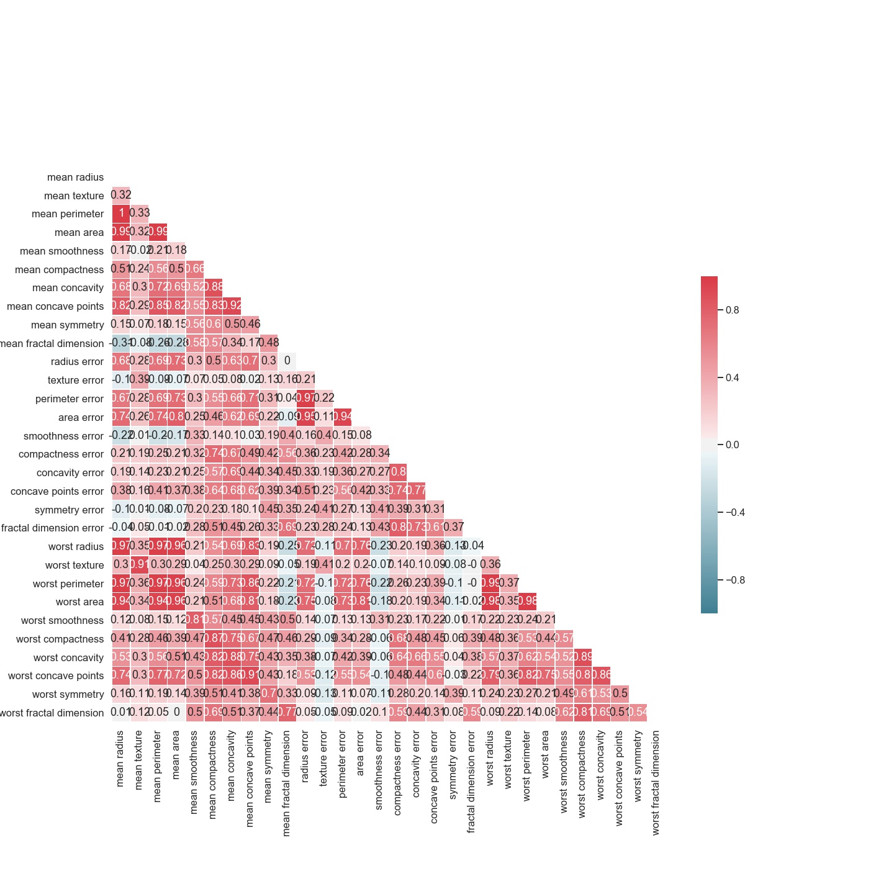
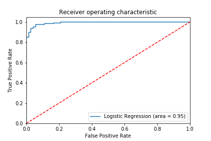

# CEBD1160_project : predicting the probabilty of breast cance of patients based on prevoius test results

| Name | Date |
|:-------|:---------------|
|Hamid Reza Taremian| June 14,2019|

-----

### Resources
Your repository should include the following:

- Python script for your analysis
- Results figure/saved file
- Dockerfile for your experiment
- runtime-instructions in a file named RUNME.md

-----

## Research Question

Based on the information provided from a patients' test, how probalbe is it for her to have breast cancer? 

### Abstract

4 sentence longer explanation about your research question. Include:

we have a data set provided bu Sklearn which has gathered data from 569 cases. this data has 30 feature for each case and specifies that for this specific case the tumor is Melignant or Benign.
we ae trying to bulid a model, based on the data we have, tp predict future cases' probability of breast caner. 
To do this, first we have to do some pre-processing on the daat at hand, devide it into trainign and test sets and finally feed them into our model(). in the end, we will evaluate our model by feedign the test cases and see how accurate it can predict the results.
- resolution (what did we end up producing)

### Introduction
Breast cancer (BC) is one of the most common cancers among women worldwide, representing the majority of new cancer cases and cancer-related deaths according to global statistics, making it a significant public health problem in today’s society.
The early diagnosis of BC can improve the prognosis and chance of survival significantly, as it can promote timely clinical treatment to patients. Further accurate classification of benign tumors can prevent patients undergoing unnecessary treatments. Thus, the correct diagnosis of BC and classification of patients into malignant or benign groups is the subject of much research. Because of its unique advantages in critical features detection from complex BC datasets, machine learning (ML) is widely recognized as the methodology of choice in BC pattern classification and forecast modelling.[https://towardsdatascience.com/building-a-simple-machine-learning-model-on-breast-cancer-data-eca4b3b99fa3]

In ordet to address this matter using Machine learnign algorithms, there is always a need to have a data set.In this project, we are working on the Breast Canscer Data set provided in the toy data set section of Sklearn.

Below we will see how the daat has been gathered and contains what features: 

Features are computed from a digitized image of a fine needle aspirate (FNA) of a breast mass. They describe characteristics of the cell nuclei present in the image. n the 3-dimensional space is that described in: [K. P. Bennett and O. L. Mangasarian: "Robust Linear Programming Discrimination of Two Linearly Inseparable Sets", Optimization Methods and Software 1, 1992, 23-34].
Attribute Information:

1) ID number 2) Diagnosis (M = malignant, B = benign) 3-32)

Ten real-valued features are computed for each cell nucleus:

a) radius (mean of distances from center to points on the perimeter) b) texture (standard deviation of gray-scale values) c) perimeter d) area e) smoothness (local variation in radius lengths) f) compactness (perimeter^2 / area - 1.0) g) concavity (severity of concave portions of the contour) h) concave points (number of concave portions of the contour) i) symmetry j) fractal dimension ("coastline approximation" - 1)

The mean, standard error and "worst" or largest (mean of the three largest values) of these features were computed for each image, resulting in 30 features. For instance, field 3 is Mean Radius, field 13 is Radius SE, field 23 is Worst Radius.

All feature values are recoded with four significant digits.

Missing attribute values: none

Class distribution: 357 benign, 212 malignant[Kaggle data sets- breast cancer data set]
### Methods

Brief (no more than 1-2 paragraph) description about how you decided to approach solving it. Include:

- pseudocode for this method (either created by you or cited from somewhere else)
- why you chose this method

### Results
The receiver operating characteristic (ROC) curve is another common tool used with binary classifiers. The dotted line represents the ROC curve of a purely random classifier; a good classifier stays as far away from that line as possible (toward the top-left corner).

### Discussion
Brief (no more than 1-2 paragraph) description about what you did. Include:

- interpretation of whether your method "solved" the problem
- suggested next step that could make it better.

### References
All of the links

-------
