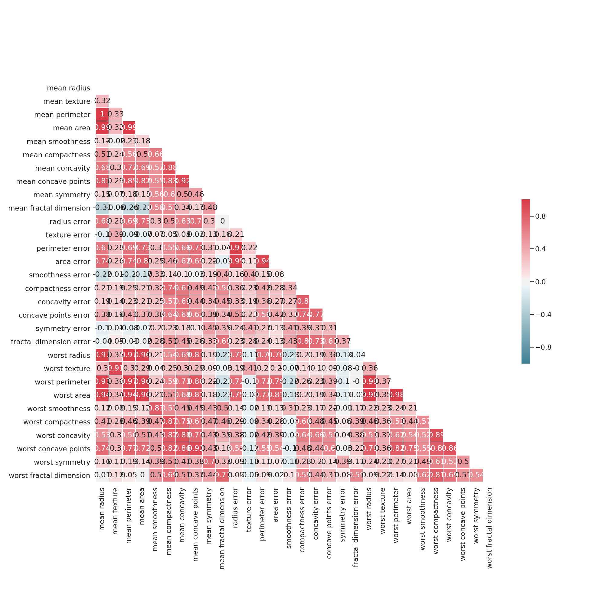
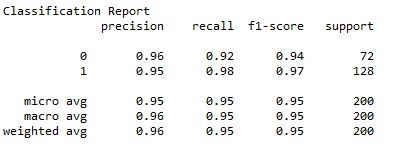
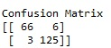
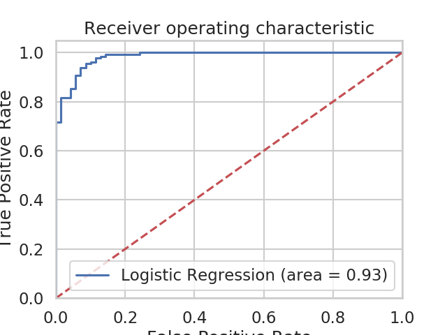

# CEBD1160_project : predicting the probabilty of breast cance of patients based on prevoius test results

| Name | Date |
|:-------|:---------------|
|Hamid Reza Taremian| June 14,2019|

-----

### Resources
Your repository should include the following:

- Python script for your analysis: Final_projects_LogReg.py
- Results figure/saved file :./plots
- Dockerfile for your experiment :Dockerfile
- runtime-instructions : 1- docker build -t project .  2-docker run -v c:/users/hamid.t/Final_Project/:/./plots project

Attention: c:/users/hamid.t/Final_Project/ is the local place on the machine to save the files.

-----

## Research Question

Based on the information provided from a patients' test, how probalbe is it for her to have breast cancer? 

### Abstract

we have a data set provided bu Sklearn which has gathered data from 569 cases. this data has 30 feature for each case and specifies that for this specific case the tumor is Melignant or Benign.
we ae trying to bulid a model, based on the data we have, tp predict future cases' probability of breast caner. 
To do this, first we have to do some pre-processing on the data at hand, devide it into training and test sets and finally feed them into our model(Logistic Regression). In the end, we will evaluate our model by feedign the test cases and see how accurate it can predict the results.The metrics used to evaluate the results is the f1score, confusiuon matrix and ROC curve.

### Introduction
Breast cancer (BC) is one of the most common cancers among women worldwide, representing the majority of new cancer cases and cancer-related deaths according to global statistics, making it a significant public health problem in today’s society.
The early diagnosis of BC can improve the prognosis and chance of survival significantly, as it can promote timely clinical treatment to patients. Further accurate classification of benign tumors can prevent patients undergoing unnecessary treatments. Thus, the correct diagnosis of BC and classification of patients into malignant or benign groups is the subject of much research. Because of its unique advantages in critical features detection from complex BC datasets, machine learning (ML) is widely recognized as the methodology of choice in BC pattern classification and forecast modelling.[https://towardsdatascience.com/building-a-simple-machine-learning-model-on-breast-cancer-data-eca4b3b99fa3]

In ordet to address this matter using Machine learnign algorithms, there is always a need to have a data set.In this project, we are working on the Breast Canscer Data set provided in the toy data set section of Sklearn.

Below we will see how the daat has been gathered and contains what features: 

Features are computed from a digitized image of a fine needle aspirate (FNA) of a breast mass. They describe characteristics of the cell nuclei present in the image. n the 3-dimensional space is that described in: [K. P. Bennett and O. L. Mangasarian: "Robust Linear Programming Discrimination of Two Linearly Inseparable Sets", Optimization Methods and Software 1, 1992, 23-34].
Attribute Information:

1) ID number 2) Diagnosis (M = malignant, B = benign) 3-32)

Ten real-valued features are computed for each cell nucleus:

a) radius (mean of distances from center to points on the perimeter) b) texture (standard deviation of gray-scale values) c) perimeter d) area e) smoothness (local variation in radius lengths) f) compactness (perimeter^2 / area - 1.0) g) concavity (severity of concave portions of the contour) h) concave points (number of concave portions of the contour) i) symmetry j) fractal dimension ("coastline approximation" - 1)

The mean, standard error and "worst" or largest (mean of the three largest values) of these features were computed for each image, resulting in 30 features. For instance, field 3 is Mean Radius, field 13 is Radius SE, field 23 is Worst Radius.

All feature values are recoded with four significant digits.

Missing attribute values: none

Class distribution: 357 benign, 212 malignant[Kaggle data sets- breast cancer data set]
### Methods

Fist we can have a better understanding of the data with showing the relations bewteen features using pairplot

Then we investigate the correlation between the features using seaborn heat map:

In order to solve this problem we are using Logistic Regression. The reason why we chose this method is that first of all we have a classification problem as the outputs are two classes of Malignant and benign tumors. second, the data set is not very complex, so we dont need to use very complicated methods.   

### Results
As we see, our logistic regression model is performing reaseaanbly according to the classification report and confusion matrix below:

However, in order to have a better understanding of our method's performance, we can use the ROC curve. The receiver operating characteristic (ROC) curve is another common tool used with binary classifiers. The dotted line represents the ROC curve of a purely random classifier; a good classifier stays as far away from that line as possible (toward the top-left corner).

  

### Discussion
Looking at the results, we can claim that our method has relatively solved this problem. For later, improvemnets we can work on the pre-processing of data and see eliminating some of the features will change the results.

### References
Sklearn data sets

kaggle dataset solutions

-------
